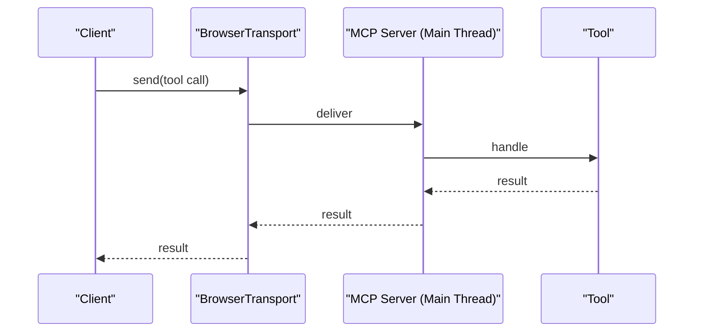
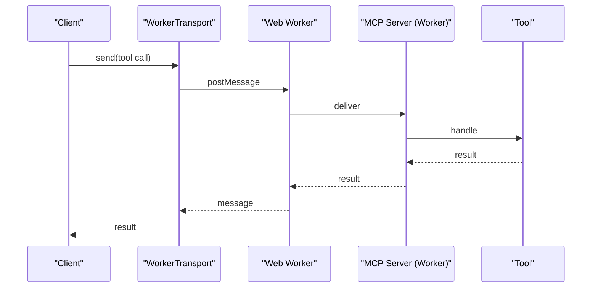

# Mcp browser project

**This project is an experiment in implementing a browser transport protocol.**

## Overview

This repository contains the browser MCP module and related logic for your project.

## Browser MCP Module Structure

All browser MCP-related logic is grouped under `lib/browser-mcp/` for clarity and maintainability.

**Structure:**

```
lib/
  browser-mcp/
    client.ts         # Browser MCP client logic
    server-core.ts    # Shared, environment-agnostic server logic
    server.main.ts    # Main-thread server implementation
    server.worker.ts  # Web Worker server entry point
    tools/            # Built-in MCP tools
      api-call-tool.ts
      echo-tool.ts
      ping-tool.ts
    transport.ts      # Browser and worker transport implementations
    use-mcp.ts        # React hook for MCP system (useMCP)

```

## MCP Protocol Flow

### Main Thread Mode



### Worker Thread Mode



For more details, see the code in `lib/browser-mcp/`.
